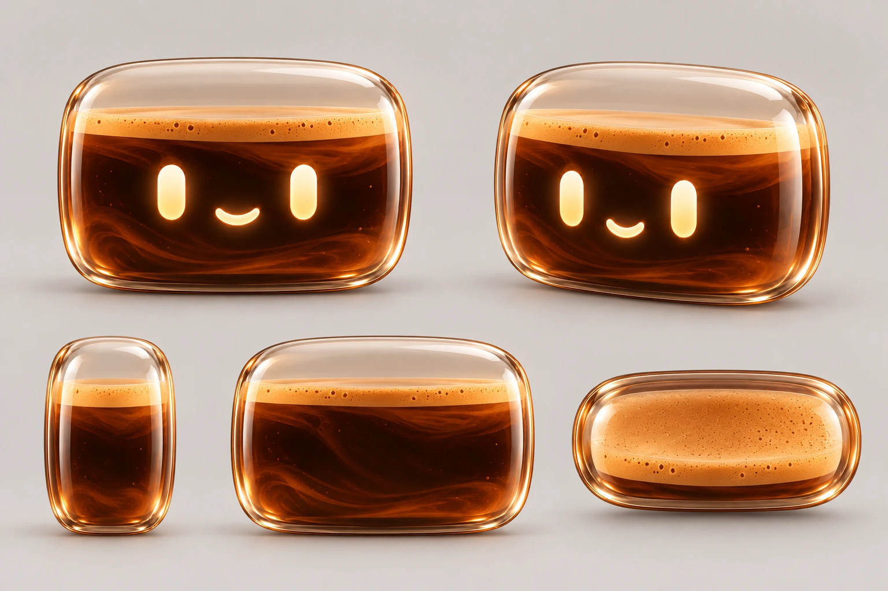

# Visual references

## Canonical source

`mascot-front-source.png` is the owner-provided identity reference. It controls the front silhouette, warm glass and coffee palette, crema treatment, face language and overall character.

## Model-sheet candidate v0.1

`model-sheet-v01-candidate.webp` extends the canonical front reference into front, front three-quarter, side, rear and top views. It is a modeling aid and remains a candidate until the views are reviewed and approved.

The written constraints in [`docs/MODEL_SHEET.md`](../docs/MODEL_SHEET.md) and [`docs/DESIGN.md`](../docs/DESIGN.md) override accidental illustration details. In particular, every production asset must keep one sealed shell, no top opening, no limbs, a 65–72% coffee fill and no face on the rear.

## Review gate

Before Phase 1 begins, approve or correct:

- front width-to-height ratio;
- three-quarter depth and front curvature;
- strict side depth;
- rear silhouette without a face;
- top silhouette and sealed-shell reading;
- coffee level, crema thickness and neutral material response.
